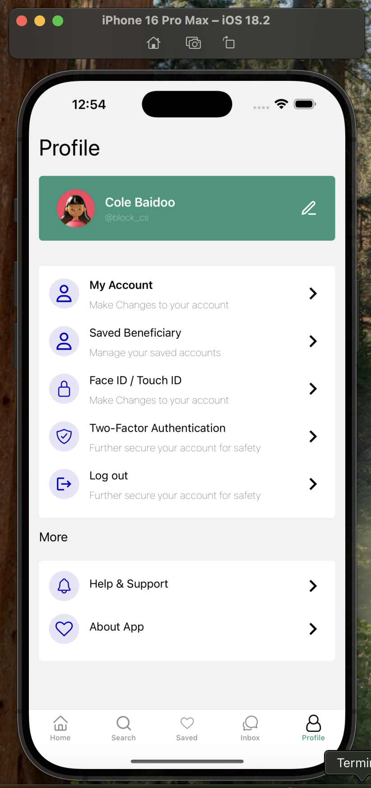

# React Native Expo Router

## Expo Router, React Components, and NativeWind Integration in React Native

### Understanding Expo Router

Expo Router is a powerful file-based routing system for React Native applications built on top of Expo. It simplifies navigation by allowing developers to define screens using a folder structure, similar to Next.js for web development. Instead of manually configuring navigation stacks, developers can create files in the `app/` directory, and Expo Router automatically generates the necessary routes.

## Key Features of Expo Router:

- **File-based Routing**: Screens are defined as files inside `app/` (e.g., `app/index.tsx`, `app/home.tsx`).
- **Automatic Linking**: No need to manually define routes; the file structure determines navigation paths.
- **Deep Linking Support**: Works seamlessly with URL-based navigation, enabling deep linking for web and mobile.
- **Nested and Dynamic Routes**: Supports folder-based nesting (`app/profile/[id].tsx`) to handle dynamic content.
- **Integration with Expo CLI**: Works efficiently with Expo-managed projects for smooth development.

### React Components in Expo Router

React components form the backbone of a React Native application. In an Expo Router environment, screens and UI elements are built using functional components that return JSX.

### Best Practices for React Components in Expo Router:

1. **Modular and Reusable Components**: Create separate components for UI elements to promote reusability (`components/Button.tsx`).
2. **State Management**: Use React’s `useState` and `useEffect` hooks for managing local component state.
3. **Lazy Loading**: Optimize performance by dynamically importing screens when needed using `React.lazy()`.
4. **Props and Context**: Pass props efficiently and use React Context for managing global state.
5. **Error Boundaries**: Implement error-handling components to prevent crashes due to unexpected errors.

### NativeWind Integration with Expo Router

NativeWind is a utility-first styling framework for React Native that brings the simplicity of Tailwind CSS. It enables developers to style components using class names, reducing the need for inline styles or StyleSheet objects.

### Setting Up NativeWind with Expo Router

It is important to review the setup guide from the [official website](https://www.nativewind.dev/docs/getting-started/installation)

### Why Configuration Files Matter

Proper configuration is crucial to ensure seamless integration of tools like Expo Router, NativeWind, and vector icons. Configuration files help in:

- **Defining Tailwind CSS Classes**: `tailwind.config.js` specifies the styles that NativeWind should process.
- **Routing Behavior**: `expo-router.config.js` can be used to customize navigation behavior.
- **Environment Variables**: `.env` files store sensitive information securely.
- **Metro Bundler Configuration**: `metro.config.js` helps optimize asset loading and module resolution.

### Best Practices for Expo Router CLI and Expo Vectors

1. Use expo-router-cli for Development:

2. Optimizing Navigation Performance:
   - Use `useMemo()` and `useCallback()` to prevent unnecessary re-renders in navigation components.
   - Avoid excessive re-renders by managing navigation state efficiently.

3. Expo Vector Icons Integration:
   - Expo provides `@expo/vector-icons`, a library containing popular icon sets like FontAwesome and Material Icons.

   - Install the package:

    ```bash
    npm install @expo/vector-icons
    ```

   - Use in components:

    ```javascript
    import { View } from "react-native";
    import { MaterialIcons } from "@expo/vector-icons";

    export default function HomeScreen() {
      return (
        <View>
          <MaterialIcons name="home" size={32} color="black" />
        </View>
      );
    }
    ```

Make reference to the Figma [page here](figma.com/design/E2BRqdPcKkrnX6hLGPto8Z/Project-Airbnb?node-id=1-2&p=f&t=xS22fRTDclMxct2m-0) for more details on the mock up

### 📝 Project Assessment (Hybrid)

Your project will be evaluated primarily through manual reviews. To ensure you receive your full score, please:

✅ Complete your project on time
📄 Submit all required files
🔗 Generate your review link
👥 Have your peers review your work

An **auto-check** will also be in place to verify the presence of core files needed for manual review.

**⏰ Important Note**
If the deadline passes, you won’t be able to generate your review link—so be sure to submit on time!

## Tasks

### 0. Navigation using Stack Navigation Patterns

**mandatory**

**Objectives**:

This task is designed to enhance your skills in developing mobile user interfaces and implementing navigation patterns using React Native. You will build a multi-screen mobile application with seamless navigation, following the Stack Navigation pattern.

[](https://www.youtube.com/watch?v=wsouAlZeOOQ)

#### Instructions:

**Step 1: Set Up Your Project**

- Create a new expo app in the directory prodev-mobile-app-0x04 using the following command:

  ```bash
  npx create-expo-app@latest prodev-mobile-app-0x04
  ```

- Navigate into the project directory:

  ```bash
  cd prodev-mobile-app-0x04
  ```

- Reset the project using:

  ```bash
  npm run reset-project
  ```

Unzip the required assets [from here](./1dc4f8a4ec32ac1f01ce14afa6e26e58bb4064c2%20(1).zip) -- (Task_0_Required_Assets zip file) and place them in the `assets/images` directory inside your project.

**Step 2:**

- From your app directory, create the following files

  - index.tsx
  - join.tsx
  - Sign.tsx

- It is important to separate our styling from our screen, to maintain a cleaner codebase. Create the following files under the root directory

  - `constants/index.ts`
  - `styles/_mainstyle.ts`
  - `styles/_joinstyle.ts`

- Replace the content of `constants/index.ts` with the following

```typescript
const BACKGROUNDIMAGE = require('@/assets/images/hero-icon.png')
const HEROLOGO = require('@/assets/images/Logo.png')
const HEROLOGOGREEN = require("@/assets/images/logo-green.png")
const GOOGLELOGO = require('@/assets/images/google.png')
const FACEBOOKLOGO = require('@/assets/images/facebook.png')

export { BACKGROUNDIMAGE, HEROLOGO, HEROLOGOGREEN, GOOGLELOGO, FACEBOOKLOGO }
```

Replace the content of `styles/_mainstyle.ts` with the following

```typescript
import { StyleSheet, Dimensions } from "react-native";

// Constants for reusable values
const COLORS = {
  white: "#fff",
};

const SPACING = {
  small: 10,
  medium: 20,
  large: 40,
};

const FONT_SIZE = {
  small: 18,
  medium: 24,
  large: 40,
};

const BORDER_RADIUS = {
  large: 36,
};

const { height } = Dimensions.get("window");

const styles = StyleSheet.create({
  container: {
    flex: 1,
  },
  backgroundImageContainer: {
    flex: 1,
    height: height,
  },
  logoContainer: {
    padding: SPACING.large,
    alignItems: "center",
    marginTop: 74,
  },
  titleContainer: {
    marginTop: SPACING.large,
  },
  titleText: {
    fontSize: FONT_SIZE.large,
    textAlign: "center",
    fontWeight: 800,
    color: COLORS.white,
  },
  titleSubTextContainer: {
    marginTop: SPACING.medium,
  },
  titleSubText: {
    fontWeight: 300,
    fontSize: FONT_SIZE.small,
    textAlign: "center",
    color: COLORS.white,
  },
  buttonPrimary: {
    backgroundColor: COLORS.white,
    alignItems: "center",
    padding: SPACING.medium,
    borderRadius: BORDER_RADIUS.large,
    flex: 1,
  },
  buttonPrimaryText: {
    fontSize: FONT_SIZE.small,
    fontWeight: 300,
    textAlign: "center",
  },
  buttonSecondary: {
    alignItems: "center",
    padding: SPACING.medium,
    borderRadius: BORDER_RADIUS.large,
    borderWidth: 1,
    borderColor: COLORS.white,
    flex: 1,
  },
  buttonSecondaryText: {
    fontSize: FONT_SIZE.small,
    fontWeight: 300,
    textAlign: "center",
    color: COLORS.white,
  },
  buttonGroup: {
    flexDirection: "row",
    alignItems: "center",
    justifyContent: "center",
    gap: SPACING.medium,
    paddingHorizontal: SPACING.medium,
  },
  buttonGroupSubText: {
    flexDirection: "row",
    justifyContent: "center",
    alignItems: "center",
    gap: SPACING.small,
    marginTop: 19,
  },
});

export { styles };
```

- Replace the content of `styles/_joinstyle.ts` with the following

```typescript
import { StyleSheet } from "react-native";

const styles = StyleSheet.create({
  container: {
    flex: 1,
    paddingHorizontal: 20
  },
  iconsection: {
    flexDirection: 'row',
    justifyContent: 'space-between',
    alignItems: 'center',
    marginTop: 22
  },
  titleTextGroup: {
    marginTop: 20
  },
  titleText: {
    fontWeight: 700,
    fontSize: 39,
  },
  subText: {
    fontWeight: 400,
    fontSize: 12,
    color: '#7E7B7B'
  },
  formGroup: {
    marginTop: 44,
    rowGap: 10
  },
  formLabel: {
    fontSize: 18,
    fontWeight: 400,
    color: '#7B7B7B',
    marginBottom: 7
  },
  formControl: {
    borderWidth: 2,
    height: 50,
    borderRadius: 10,
    borderColor: '#E9E9E9',
    paddingHorizontal: 10
  },
  formPasswordControl: {
    borderWidth: 2,
    height: 50,
    borderRadius: 10,
    borderColor: '#E9E9E9',
    paddingHorizontal: 10,
    flexDirection: 'row',
    alignItems: 'center'
  },
  passwordControl: {
    flex: 1
  },
  primaryButton: {
    backgroundColor: '#34967C',
    height: 53,
    borderRadius: 10,
    justifyContent: 'center',
    alignItems: 'center',
    marginTop: 25
  },
  buttonText: {
    color: 'white',
    fontSize: 17,
    fontWeight: 300
  },
  secondaryButtonGroup: {
    rowGap: 15,
    marginTop: 15,
  },
  secondaryButton: {
    height: 53,
    borderRadius: 10,
    justifyContent: 'center',
    alignItems: 'center',
    flexDirection: 'row',
    columnGap: 10,
    borderWidth: 1,
  },
  secondaryButtonText: {
    fontSize: 18,
    fontWeight: 400
  },
  signupgroup: {
    flexDirection: 'row',
    justifyContent: 'center',
    position: 'absolute',
    left: 77, 
    right: 76,
    bottom: 33
  },
  signupTitleText: {
    fontSize: 18,
    fontWeight: 400
  },
  signupSubTitleText: {
    fontSize: 18,
    fontWeight: 600,
    color: '#FFA800'
  },
  dividerGroup: {
    flexDirection: 'row',
    alignItems: 'center',
    columnGap: 10,
    marginBottom: 25,
    marginTop: 29,
  },
  divider: {
    borderWidth: 1,
    flex: 1,
    borderColor: '#e6e6e6'
  },
  dividerText: {
    fontSize: 17,
    fontWeight: 500,
    fontVariant: ['small-caps'],
    color: '#C2C2C2'
  },
  forgotPasswordText: {
    textAlign: 'right',
    color: '#34967C',
    marginTop: 9,
  }
});

export { styles }
```

**Step 3:**

- Setting up your screens. Note that we have already worked on the following screen from our previous tasks.

  - index.tsx (Move the contents from the following repository prodev-mobile-app/ prodev-mobile-app-0x02)
  - signin.tsx (Move the contents from the following repository prodev-mobile-app/ prodev-mobile-app-0x03)
  - Join.tsx : Notice the design for join now is similar to that of the sign in? Make the necessary changes to reflect the view.

**Step 4:**

- Setting up the Layout pattern help expo decide the Navigation pattern to be used. From your `app/_layout.tsx` replace the content with the following:

```typescript
import { Stack } from "expo-router";
import { View } from 'react-native'

export default function RootLayout() {
  return (
    <Stack screenOptions={{
      headerShown: false,
    }}>
      <Stack.Screen name="/" />
      <Stack.Screen name="join" />
      <Stack.Screen name="signin" />
    </Stack>
  );
}
```

**Step 5:**

- Start your application using the command:

```bash
npx expo start
```

- Scan the QR code on your terminal with your device (iOS or Android) and text.

**Repo**:

- **GitHub repository**: **prodev-mobile-app**
- **Directory**: **prodev-mobile-app-0x04**
- **File**: [app/index.tsx](./prodev-mobile-app-0x04/app/index.tsx), [app/join.tsx](./prodev-mobile-app-0x04/app/join.tsx), [app/signin.tsx](./prodev-mobile-app-0x04/app/signin.tsx), [styles/_mainstyle.ts](./prodev-mobile-app-0x04/styles/_mainstyle.ts), [styles/_join.ts](./prodev-mobile-app-0x04/styles/_join.ts), [constants/index.ts](./prodev-mobile-app-0x04/constants/index.ts), [app/_layout.tsx](./prodev-mobile-app-0x04/app/_layout.tsx), [app.json](./prodev-mobile-app-0x04/app.json), [assets/images/google.png](./prodev-mobile-app-0x04/assets/images/google.png), [assets/images/logo.png](./prodev-mobile-app-0x04/assets/images/logo.png), [assets/images/splash.png](./prodev-mobile-app-0x04/assets/images/splash.png), [assets/images/facebook.png](./prodev-mobile-app-0x04/assets/images/facebook.png)

### 1. Navigation using Tabs Navigation Patterns

**mandatory**

**Objectives**:

In mobile app development, navigation is important for a smooth user experience. Stack navigation is useful for moving between screens in order, like going from a home screen to a details screen. However, many modern apps use tab navigation to organize content better.

In this task, we will learn about Tab Navigation, a common way to switch between different sections of an app. We will build on our previous project from prodev-mobile-app-0x04, adding Tab Navigation to make our app easier to use and more functional.

[](https://www.youtube.com/watch?v=_aCjvdMJLVo)

Here are some additional resources to guide you

- [Expo vectors here](https://icons.expo.fyi/Index)
- [Expo Navigation patterns here](https://docs.expo.dev/router/basics/layout/#root-layout)

#### Instructions:

**Step 1:**

Duplicate project `prodev-mobile-app-0x04` to `prodev-mobile-app-0x05`

Create the following files:

- `app/(home)/_layout.tsx`
- `app/(home)/index.tsx`
- `app/(home)/profile.tsx`
- `app/(home)/saved.tsx`
- `app/(home)/search.tsx`
- `app/(home)/inbox.tsx`
- `components/common/PropertyListingCard.tsx`
- `components/PropertyListing`

**Step 2:**

*N.B: Don’t feel tempted to copy and paste the following code samples. It is important you type them. *

Replace the content of `app/(home)/_layout.tsx` with the following:

```typescript
import { AntDesign, EvilIcons, Feather, FontAwesome, Ionicons } from "@expo/vector-icons";
import { Tabs } from "expo-router";

const HomeRootLayout = () => {
  return (
    <Tabs screenOptions={{
        tabBarActiveTintColor: '#34967C',
        headerShown: false
    }} >
      <Tabs.Screen name="index" options={{
        title: 'Home',
        tabBarIcon: ({ color }) => <AntDesign name="home" size={24} color={color} />,
      }} />
      <Tabs.Screen name="search" options={{
        title: 'Search',
        headerShown: true,
        tabBarIcon: ({ color }) => <Feather name="search" size={24} color={color} />,
      }} />
      <Tabs.Screen name="saved" options={{
        title: 'Saved',
        headerShown: true,
        tabBarIcon: ({ color }) => <EvilIcons name="heart" size={27} color={color} />
      }} />
        <Tabs.Screen name="inbox" options={{
        title: 'Inbox',
        headerShown: true,
        tabBarIcon: ({ color }) => <Ionicons name="chatbubbles-outline" size={24} color={color} />
      }} />
        <Tabs.Screen name="profile" options={{
        title: 'Profile',
        headerShown: true,
        tabBarIcon: ({ color }) => <FontAwesome name="user-o" size={24} color="black" />
      }} />
    </Tabs>
  )
}

export default HomeRootLayout;
```

Replace the content of `app/(home)/index.tsx` with the following:

```typescript
import PropertyListing from "@/components/PropertyListing";
import { styles } from "@/styles/_homestyle";
import { Feather } from "@expo/vector-icons";
import {
  View,
  Text,
  TextInput,
  Image,
  ScrollView,
  Dimensions,
  TouchableHighlight,
} from "react-native";
import { FILTERS, SAMPLE_DATA } from "@/constants/data";

const Home = () => {
  return (
    <View style={styles.container}>
      <View style={styles.searchGroup}>
        <View style={styles.searchFormGroup}>
          <View style={styles.searchControlGroup}>
            <Text style={styles.searchFormText}>Where to?</Text>
            <TextInput
              style={{ ...styles.searchControl, ...styles.searchFormText }}
              placeholder="Location . Date . Add guest"
            />
          </View>
          <View style={styles.searchButton}>
            <Feather name="search" size={24} color="white" />
          </View>
        </View>
      </View>

      <View
        style={{
          height: 72,
          backgroundColor: "white",
        }}
      >
        <ScrollView horizontal showsHorizontalScrollIndicator={false}>
          <View style={styles.filterGroup}>
            {FILTERS.map((filter, index) => (
              <View style={styles.filterContainer} key={index}>
                <Image
                  style={{
                    flex: 1,
                  }}
                  source={require("@/assets/images/mansion.png")}
                  resizeMode="contain"
                />
                <Text>{filter}</Text>
              </View>
            ))}
          </View>
        </ScrollView>
      </View>

      <ScrollView style={styles.listingContainer}>
        <PropertyListing listings={SAMPLE_DATA} />
        <View style={styles.paginationContainer}>
          <TouchableHighlight style={styles.showMoreButton}>
            <Text style={styles.showMoreButtonText}>Show more</Text>
          </TouchableHighlight>
        </View>
      </ScrollView>
    </View>
  );
};

export default Home;
```

Replace content `app/(home)/profile.tsx` with the following:

```typescript
import { View, Text } from "react-native";

const Profile = () => {
  return (
      <View>
        <Text>Profile Screen</Text>
      </View>
  )
}

export default Profile;
```

Repeat the same procedure from the step above to the following files:

- `app/(home)/saved.tsx`
- `app/(home)/search.tsx`
- `app/(home)/inbox.tsx`

**Step 3:**

Create individual components.

Replace the content of `components/common/PropertyListingCard.tsx` with the following:

```typescript
import { View, Text, StyleSheet, ImageBackground } from "react-native";
import EvilIcons from "@expo/vector-icons/EvilIcons";
import MaterialIcons from "@expo/vector-icons/MaterialIcons";
import { PropertyListingProps } from "@/interfaces";
import FontAwesome from "@expo/vector-icons/FontAwesome";
import { styles } from "@/styles/_propertyCardStyle";

const PropertyListingCard: React.FC<PropertyListingProps> = ({
  propertyName,
  rate,
  currency,
  amount,
  location,
  favorite,
}) => {
  return (
    <ImageBackground
      source={require("@/assets/images/sample-image.png")}
      style={styles.container}
    >
      <View style={styles.overlay}>
        <View style={styles.favoriteGroup}>
          <View style={styles.favoriteOverlay}>
            {favorite ? (
              <FontAwesome name="heart" size={24} color="#E50000" />
            ) : (
              <EvilIcons name="heart" size={32} color="white" />
            )}
          </View>
        </View>

        <View style={styles.group}>
          <View style={styles.rateGroup}>
            <MaterialIcons name="star-rate" size={40} color="#FAC02B" />
            <Text style={styles.rateText}>{rate}</Text>
          </View>
          <View style={styles.cardGroup}>
            <View style={styles.cardTextGroup}>
              <Text style={styles.cardLargeText}>{propertyName}</Text>
              <Text style={styles.cardSmallText}>
                {location.street}, {location.city}, {location.country}
              </Text>
            </View>
            <View style={styles.priceGroup}>
              <Text style={styles.priceText}>
                {currency}
                {amount}
              </Text>
            </View>
          </View>
        </View>
      </View>
    </ImageBackground>
  );
};

export default PropertyListingCard;
```

Replace the content of `components/PropertyListing` with the following:

```typescript
import { View, Text } from "react-native";
import PropertyListingCard from "./common/PropertyListingCard";
import { useState } from "react";
import { PropertListing, PropertyListingProps } from "../interfaces";

const PropertyListing = ({ listings }: PropertListing) => {
  return (
    <View
      style={{
        flex: 1,
        rowGap: 10,
      }}
    >
      {listings?.map((listing, key) => (
        <PropertyListingCard {...listing} key={key} />
      ))}
    </View>
  );
};

export default PropertyListing;
```

Create the stylesheet for your `PropertyListingCard`. Create `styles/propertyCardStyle.ts`

Replace the content of `styles/propertyCardStyle.ts` with the following:

```typescript
const styles = StyleSheet.create({
    container: {
      height: 400,
      borderRadius: 10,
      overflow: "hidden",
      marginBottom: 16,
    },
    overlay: {
      height: 400,
      backgroundColor: "rgba(0,0,0,0.3)",
      padding: 16,
      justifyContent: "space-between",
    },
    favoriteGroup: {
      alignItems: "flex-end",
    },
    favoriteOverlay: {
      backgroundColor: "rgba(0,0,0,0.4)",
      width: 48,
      height: 48,
      borderRadius: 24,
      alignItems: "center",
      justifyContent: "center",
    },
    rateGroup: {
      flexDirection: "row",
      alignItems: "center",
      columnGap: 5,
    },
    rateText: {
      fontSize: 20,
      color: "#fff",
      fontWeight: 500,
      marginLeft: 4,
    },
    priceGroup: {
      backgroundColor: "#F9F9F9",
      width: 104,
      height: 45,
      borderRadius: 30,
      alignItems: "center",
      justifyContent: "center",
    },
    priceText: {
      fontSize: 17,
      fontWeight: 500,
    },
    cardTextGroup: {
      width: 205,
    },
    cardLargeText: {
      fontSize: 30,
      fontWeight: 600,
      color: "#fff",
    },
    cardSmallText: {
      fontSize: 15,
      fontWeight: 400,
      color: "#fff",
    },
    cardGroup: {
      flexDirection: "row",
      columnGap: 40,
      alignItems: "center",
    },
    group: {
      position: "absolute",
      bottom: 30,
      left: 30,
    },
  });

  export { styles }
```

**Step 4:**

Realize from step 3 we use `PropertyListingProps` interface. Let’s setup some interfaces

Create the following file

- `interfaces/index.ts`
Replace the content of `interfaces/index.ts` with the following:

```typescript
export interface PropertyListingProps {
    propertyName: string,
    rate: number,
    currency: string,
    amount: number,
    location: PropertyLocationProps,
    favorite: boolean,
    image?: string
}

export interface PropertyLocationProps {
    street: string,
    city: string,
    country: string
}

export interface PropertListing {
    listings: PropertyListingProps []
}
```

Also create a **sample data set**, since we are not ready to fetch from a remote server.

Create the following files:

- `constants/data.ts`

Replace the content of `constants/data.ts` with the following:

```typescript
import { PropertyListingProps } from "@/interfaces";

const SAMPLE_DATA : PropertyListingProps[] = [
    {
      propertyName: "Villa Arrciffee Beach House",
      location: {
        street: "123 Ocean Drive",
        city: "Miami",
        country: "USA"
      },
      rate: 4.76,
      currency: "$",
      amount: 620,
      favorite: false
    },
    {
      propertyName: "Sunset Paradise Villa",
      location: {
        street: "456 Beachfront Lane",
        city: "Cancun",
        country: "Mexico"
      },
      rate: 4.85,
      currency: "$",
      amount: 750,
      favorite: true
    },
    {
      propertyName: "Golden Sands Retreat",
      location: {
        street: "789 Coastal Road",
        city: "Gold Coast",
        country: "Australia"
      },
      rate: 4.92,
      currency: "$",
      amount: 900,
      favorite: false
    },
    {
      propertyName: "Azure Horizon Cottage",
      location: {
        street: "321 Seaside Avenue",
        city: "Nice",
        country: "France"
      },
      rate: 4.78,
      currency: "$",
      amount: 680,
      favorite: false
    },
    {
      propertyName: "Palm Haven Villa",
      location: {
        street: "654 Palm Street",
        city: "Bali",
        country: "Indonesia"
      },
      rate: 4.88,
      currency: "$",
      amount: 1200,
      favorite: true
    },
    {
      propertyName: "Ocean Breeze Mansion",
      location: {
        street: "987 Marina Drive",
        city: "Dubai",
        country: "UAE"
      },
      rate: 4.95,
      currency: "$",
      amount: 2500,
      favorite: false
    },
    {
      propertyName: "Seaside Serenity House",
      location: {
        street: "147 Ocean View Road",
        city: "Phuket",
        country: "Thailand"
      },
      rate: 4.81,
      currency: "$",
      amount: 1500,
      favorite: false
    },
    {
      propertyName: "Coral Reef Villa",
      location: {
        street: "258 Coral Lane",
        city: "Maldives",
        country: "Maldives"
      },
      rate: 4.89,
      currency: "$",
      amount: 850,
      favorite: false
    },
    {
      propertyName: "Tropical Bliss Retreat",
      location: {
        street: "369 Palm Beach Road",
        city: "Maui",
        country: "USA"
      },
      rate: 4.83,
      currency: "$",
      amount: 720,
      favorite: false
    },
    {
      propertyName: "Emerald Bay Cottage",
      location: {
        street: "741 Bayfront Avenue",
        city: "Santorini",
        country: "Greece"
      },
      rate: 4.90,
      currency: "$",
      amount: 780,
      favorite: true
    }
  ];


const FILTERS: string [] = [
    "Mansion",
    "CountrySide",
    "Villa",
    "Tropical",
    "New",
    "Amazing",
    "Beachfront",
    "Luxury",
    "Family-Friendly",
    "Pet-Friendly",
    "Secluded"
  ];
  export { SAMPLE_DATA, FILTERS }
```

Start and text your application on Expo Go

**Repo**:

- **GitHub repository**: **prodev-mobile-app**
- **Directory**: **prodev-mobile-app-0x05**
- **File**: [app/index.tsx](./prodev-mobile-app-0x05/app/index.tsx), [app/join.tsx](./prodev-mobile-app-0x05/app/join.tsx), [app/signin.tsx](./prodev-mobile-app-0x05/app/signin.tsx), [app/(home)/index.tsx](./prodev-mobile-app-0x05/app/(home)/index.tsx), [app/(home)/_layout.tsx](./prodev-mobile-app-0x05/app/(home)/_layout.tsx), [app/(home)/search.tsx](./prodev-mobile-app-0x05/app/(home)/search.tsx), [app/(home)/profile.tsx](./prodev-mobile-app-0x05/app/(home)/profile.tsx), [app/(home)/saved.tsx](./prodev-mobile-app-0x05/app/(home)/saved.tsx), [app/(home)/inbox.tsx](./prodev-mobile-app-0x05/app/(home)/inbox.tsx), [styles/_mainstyle.ts](./prodev-mobile-app-0x05/styles/_mainstyle.ts), [styles/_join.ts](./prodev-mobile-app-0x05/styles/_join.ts), [styles/_propertyCardStyle.ts](./prodev-mobile-app-0x05/styles/_propertyCardStyle.ts)

### 2. Styling with NativeWind (TailwindCSS)

**mandatory**

**Objectives**

Tailwind CSS helps speed up development with ready-to-use utility classes. However, React Native doesn’t support Tailwind by default. To use it, we need NativeWind, a tool that makes Tailwind work smoothly in React Native. Setting it up isn’t straightforward, so it’s important to follow the installation guide carefully here.



For this task, we’ll continue working on `prodev-mobile-app-0x05` and style it using Tailwind CSS.

#### Instructions

**Step 1:**

- Make a copy of `prodev-mobile-app-0x05` and rename it to `prodev-mobile-app-0x06`

- **Review Documentation** Check the NativeWind integration with [Expo Router documentation here](https://www.nativewind.dev/docs/getting-started/installation)

- **Modify** `_layout.tsx`

  - Open `app/(home)/_layout.tsx` and remove the **headerShown** option from the Profile tab.

- **Organize Styles** Move `global.css` into the styles directory.

- **Check Configurations** Ensure all required configuration files are correctly set up.

- **Update profile.tsx** Modify `app/(home)/profile.tsx` with the provided content.

```typescript
import { View, Text, Image, Pressable } from "react-native";
import { SafeAreaProvider, SafeAreaView } from "react-native-safe-area-context";
import Feather from "@expo/vector-icons/Feather";
import FontAwesome6 from "@expo/vector-icons/FontAwesome6";
import MaterialIcons from "@expo/vector-icons/MaterialIcons";
import Ionicons from "@expo/vector-icons/Ionicons";

const Profile = () => {
  return (
    <SafeAreaProvider>
      <SafeAreaView className=" flex-1 p-4">
        <Text className=" text-black  text-4xl font-normal mb-6">Profile</Text>
        <View className=" bg-[#34967C] h-[90px] mb-10 flex-row items-center rounded-md justify-between px-7">
          <View className="flex-row items-center gap-4">
            <Image source={require("@/assets/images/user-image.png")} />
            <View>
              <Text className=" font-semibold text-xl text-white">
                Cole Baidoo
              </Text>
              <Text className="text-sm font-thin text-white">@block_cs</Text>
            </View>
          </View>
          <Feather name="edit-3" size={24} color="white" />
        </View>

        <View className="h-[350px] gap-3 bg-white rounded-md p-4 mb-4">
          <Pressable className="flex-row items-center justify-between mb-2">
            <View className="flex-row items-center gap-4">
              <View className="w-12 h-12 bg-[#0601B4]/10 items-center justify-center rounded-full ">
                <FontAwesome6 name="user" size={24} color="#0601B4" />
              </View>
              <View>
                <Text className=" text-lg font-semibold mb-2">My Account</Text>
                <Text className=" font-thin text-gray-700">
                  Make Changes to your account
                </Text>
              </View>
            </View>
            <MaterialIcons
              name="keyboard-arrow-right"
              size={34}
              color="black"
            />
          </Pressable>
          <Pressable className="flex-row items-center justify-between mb-2">
            <View className="flex-row items-center gap-4">
              <View className="w-12 h-12 bg-[#0601B4]/10 items-center justify-center rounded-full ">
                <FontAwesome6 name="user" size={24} color="#0601B4" />
              </View>
              <View>
                <Text className=" text-lg font-normal mb-2">
                  Saved Beneficiary
                </Text>
                <Text className=" font-thin text-gray-700">
                  Manage your saved accounts
                </Text>
              </View>
            </View>
            <MaterialIcons
              name="keyboard-arrow-right"
              size={34}
              color="black"
            />
          </Pressable>
          <Pressable className="flex-row items-center justify-between mb-2">
            <View className="flex-row items-center gap-4">
              <View className="w-12 h-12 bg-[#0601B4]/10 items-center justify-center rounded-full ">
                <Ionicons
                  name="lock-closed-outline"
                  size={24}
                  color="#0601B4"
                />
              </View>
              <View>
                <Text className=" text-lg font-normal mb-2">
                  Face ID / Touch ID
                </Text>
                <Text className=" font-thin text-gray-700">
                  Make Changes to your account
                </Text>
              </View>
            </View>
            <MaterialIcons
              name="keyboard-arrow-right"
              size={34}
              color="black"
            />
          </Pressable>
          <Pressable className="flex-row items-center justify-between mb-2">
            <View className="flex-row items-center gap-4">
              <View className="w-12 h-12 bg-[#0601B4]/10 items-center justify-center rounded-full ">
                <Ionicons
                  name="shield-checkmark-outline"
                  size={24}
                  color="#0601B4"
                />
              </View>
              <View>
                <Text className=" text-lg font-normal mb-2">
                  Two-Factor Authentication
                </Text>
                <Text className=" font-thin text-gray-700">
                  Further secure your account for safety
                </Text>
              </View>
            </View>
            <MaterialIcons
              name="keyboard-arrow-right"
              size={34}
              color="black"
            />
          </Pressable>
          <Pressable className="flex-row items-center justify-between mb-2">
            <View className="flex-row items-center gap-4">
              <View className="w-12 h-12 bg-[#0601B4]/10 items-center justify-center rounded-full ">
                <MaterialIcons name="logout" size={24} color="#0601B4" />
              </View>
              <View>
                <Text className=" text-lg font-normal mb-2">Log out</Text>
                <Text className=" font-thin text-gray-700">
                  Further secure your account for safety
                </Text>
              </View>
            </View>
            <MaterialIcons
              name="keyboard-arrow-right"
              size={34}
              color="black"
            />
          </Pressable>
        </View>

        <Text className=" text-black  text-xl font-normal mb-6">More</Text>

        <View className="h-[139px] gap-3 bg-white rounded-md p-4 mb-4">
          <Pressable className="flex-row items-center justify-between mb-2">
            <View className="flex-row items-center gap-4">
              <View className="w-12 h-12 bg-[#0601B4]/10 items-center justify-center rounded-full ">
                <FontAwesome6 name="user" size={24} color="#0601B4" />
              </View>
              <View>
                <Text className=" text-lg font-semibold mb-2">My Account</Text>
                <Text className=" font-thin text-gray-700">
                  Make Changes to your account
                </Text>
              </View>
            </View>
            <MaterialIcons
              name="keyboard-arrow-right"
              size={34}
              color="black"
            />
          </Pressable>
          <Pressable className="flex-row items-center justify-between mb-2">
            <View className="flex-row items-center gap-4">
              <View className="w-12 h-12 bg-[#0601B4]/10 items-center justify-center rounded-full ">
                <FontAwesome6 name="user" size={24} color="#0601B4" />
              </View>
              <View>
                <Text className=" text-lg font-normal mb-2">
                  Saved Beneficiary
                </Text>
                <Text className=" font-thin text-gray-700">
                  Manage your saved accounts
                </Text>
              </View>
            </View>
            <MaterialIcons
              name="keyboard-arrow-right"
              size={34}
              color="black"
            />
          </Pressable>
        </View>
      </SafeAreaView>
    </SafeAreaProvider>
  );
};

export default Profile;
```

**NB: Notice, how tailwind reduces the number of files and content of the Screen. This is the power of tailwindcss.**

**Step 2:**

- Start your expo app using the following command: `npx expo start`

- Verify on your Expo Go app.

**Repo**:

- **GitHub repository**: **prodev-mobile-app**
- **Directory**: **prodev-mobile-app-0x06**
- **File**: [app/_layout.tsx](./prodev-mobile-app-0x06/app/_layout.tsx), [app/(home)/profile.tsx](./prodev-mobile-app-0x06/app/(home)/profile.tsx), [tailwind.config.js](./prodev-mobile-app-0x06/tailwind.config.js), [nativewind-env.d.ts](./prodev-mobile-app-0x06/nativewind-env.d.ts), [metro.config.js](./prodev-mobile-app-0x06/metro.config.js), [babel.config.js](./prodev-mobile-app-0x06/babel.config.js), [styles/global.css](./prodev-mobile-app-0x06/styles/global.css)

### 3. React Native UI Implementation Challenge

**mandatory**

**Objective**

Mobile development is a vast and evolving space, and React Native brings the best of React to mobile platforms. This challenge will test your ability to translate UI designs into a fully functional mobile app.

#### Instructions

#### Select a Design

Choose one of the following Figma designs:

- [CoinPay App](https://www.figma.com/design/FHpsCUXuQuURQf58XprBtY/Coinpay-Fintech-Finance-Mobile-App-UI-kit--Community---Community-?node-id=685-10519&p=f&t=EmYdo21Ljet7fZen-0)
- [Coffee Shop App](figma.com/design/RhP1APTkYyHY3DTClVv5gU/Coffee-Shop-Mobile-App-Design--Community-?t=2WAEtgmXIuzlMziU-0)
- [Online Groceries App](https://www.figma.com/design/FbIovZFuJAJ5Xo4gyTTBQj/Online-Groceries-App-UI--Community-?node-id=1-2&p=f&t=ECICbjbCrzTuHNrQ-0)

**Set Up Your Project**

- Initialize a new Expo project with **TypeScript** and **NativeWindCSS** installed.

**Extract UI Assets**

- Download all necessary assets (**icons**, **images**, **fonts**) from the selected Figma file.

**Create a Repository**

- Name it using this format: **alx-[app-name]-app**
  - Example:
    - `alx-coinpay-app`
    - `alx-coffee-shop-app`
    - `alx-online-groceries-app`

**Build the Screens**

- Implement all screens as per the design.
- Document your process and challenges in the `README.md`.

**Showcase Your Work**

- Record a short demo video of your completed app.
- Share it on LinkedIn, X (Twitter), Instagram, or TikTok.
- Tag & credit the original Figma designer.

**Submit Your Work**

- Drop the link to your social media post in the submission portal.
- Drop the link to your GitHub Repository.

**Challenge yourself!** – Clean code, smooth animations, and pixel-perfect UI matter!
